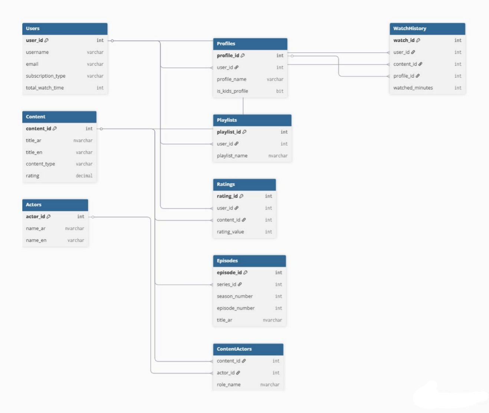

# 🎬 PlayWatch - VOD Database System
This project is a complete SQL Database for a Video-on-Demand platform, managing users, content, and watch history.

## 📊 Entity Relationship Diagram (ERD)

## 🛠️ Features
## 🛠️ Tech Stack

- User & Multi-profile management.
- Detailed Content tracking (Movies & Series).
- Watch history & completion percentage.
- Playlists & Rating systems.
